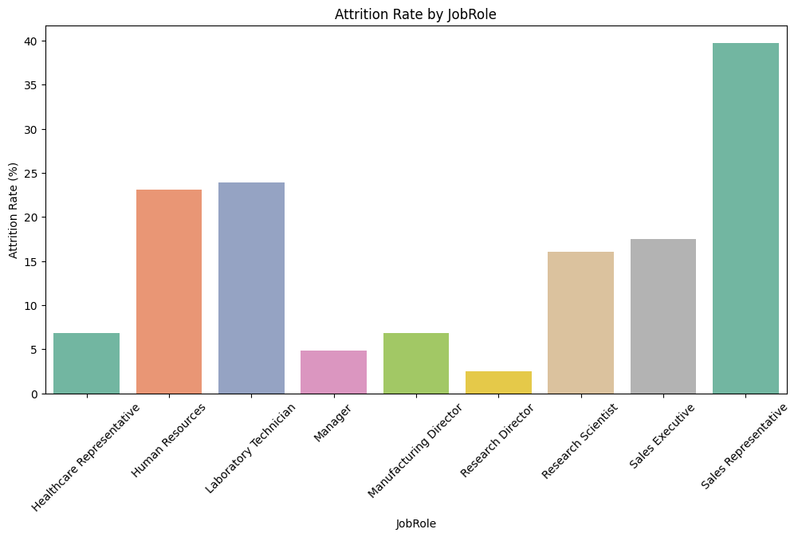
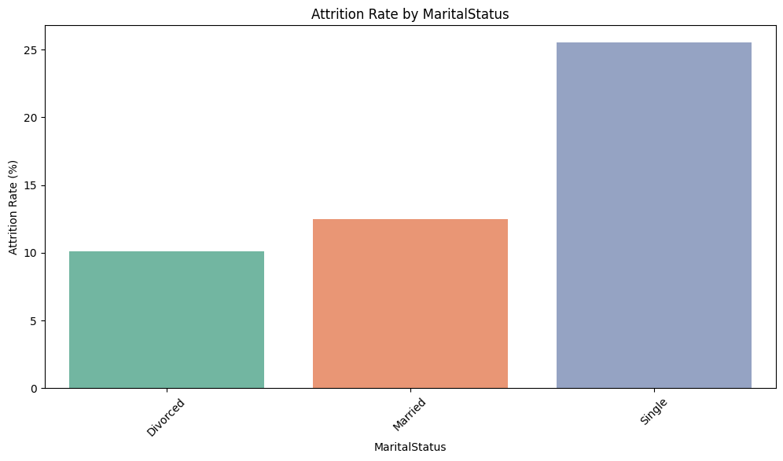
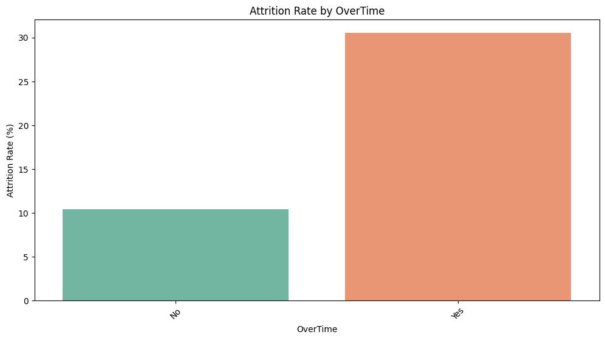

## **Disclaimer**

The code in this repository was generated with the assistance of AI. However, I have thoroughly reviewed and understand every line of the code. All analyses, models, and results presented in this project are fully understood and interpreted by me. This project demonstrates my ability to use AI-generated tools while maintaining full ownership and comprehension of the work.

---

# **Employee Attrition Analysis & Prediction**

This project analyzes employee attrition and identifies key factors that influence turnover using machine learning techniques. It includes comprehensive data analysis, insights into employee behavior, and actionable solutions for improving employee retention.

## **Data Visualizations & Analysis**

Here are some key visualizations and analysis results that highlight the most significant patterns related to employee attrition:

### **1. Attrition Rate by Job Role**
- **Sales Representatives** have the highest attrition rate, indicating that this group may require special attention to improve retention.
  


### **2. Attrition Rate by Marital Status**
- **Single employees** have a significantly higher attrition rate compared to married employees.



### **3. Attrition Rate by OverTime**
- Employees who work **Overtime** have a higher attrition rate, suggesting the need to address work-life balance.



### **4. Attrition vs Monthly Income**
- Employees with **lower monthly income** tend to leave the company more frequently.


### **5. Attrition vs Years at Company**
- Employees who have been with the company for **fewer years** are more likely to leave.


---

## **Attrition Insights Based on Various Factors**

1. **Sales Representatives** are more likely to leave with an attrition rate of **40%**.
   
2. **Singles** have a higher likelihood of leaving with an attrition rate of **25%**.
   
3. Employees working **Overtime** are more likely to leave, with an attrition rate of **30%**.
   
4. Employees who **Travel Frequently** for work have an attrition rate of **25%**, indicating a higher likelihood of leaving.
   
5. Employees in the **Sales** and **HR Departments** are more likely to leave, with an attrition rate of **20%**.
   
6. In the **Education Field**, employees with **Human Resources** and **Technical Degree** backgrounds are more likely to leave, with an attrition rate around **25%**.

7. **Males** are more likely to leave with an attrition rate of **18%**.
   
8. **Entry-Level Employees** are more likely to leave, with an attrition rate of **27%**.

---

## **Distribution of Numerical Columns for Employees Who Left (Attrition = Yes) Using Histograms**

Histograms are used to visualize how specific numerical columns (e.g., Age, MonthlyIncome, YearsAtCompany) are distributed for employees who left the company ("Attrition = Yes").

### **Key Insights from Histograms:**
- **Age**: Younger employees (e.g., ages 25–35) dominate the "Attrition = Yes" category.  
- **Monthly Income**: Employees with **lower income** levels could have a visible peak in the histogram, indicating a higher likelihood of attrition.  
- **Years at Company**: Employees who leave might have shorter tenures, with a noticeable peak around **1–2 years**.

#### Histograms for Numerical Columns:
- **Age**
- **MonthlyIncome**
- **TotalWorkingYears**
- **DistanceFromHome**
- **YearsAtCompany**
- **TrainingTimesLastYear**
- **PercentSalaryHike**

---

## **Machine Learning Model Evaluation**

In addition to the analysis, several machine learning models were built and evaluated to predict employee attrition:

### **Models Used:**
- **Random Forest Classifier**
- **Logistic Regression**
- **K-Nearest Neighbors (KNN)**

These models were tested and evaluated based on:
- **Accuracy**
- **Precision**
- **Recall**
- **F1-Score**

### **Best Model: Random Forest**
The **Random Forest Classifier** performed the best in terms of accuracy and balance between precision and recall.

---

## **Findings and Recommendations for HR Department**

### **Employees Are More Likely to Leave If:**

1. They are **Sales Representatives** (Attrition rate: **40%**).
2. They are **Single** (Attrition rate: **25%**).
3. They work **Overtime** (Attrition rate: **30%**).
4. They **Travel Frequently** for work (Attrition rate: **25%**).
5. They work in the **Sales** or **HR Departments** (Attrition rate: **20%**).
6. They have an **HR** or **Technical Degree** (Attrition rate: **25%**).
7. They are **Male** (Attrition rate: **18%**).
8. They are **Entry-Level Employees** (Attrition rate: **27%**).
9. They are **Middle-Aged**.
10. They have **Low Income**.
11. They are **New Employees** (relatively new to the organization).
12. They live **near the office** (commute distance seems less significant).
13. They’ve received **minimal training** (only a couple of times).
14. They’ve had **small salary hikes** (below **18%**).

---

### **Solutions to Improve Employee Retention:**

1. **Provide Career Growth**  
   - Offer training and career paths, especially for **entry-level** and **middle-aged** employees.

2. **Improve Salary & Benefits**  
   - Adjust salaries and offer bonuses or performance incentives, especially for **Sales Representatives** and employees with **low income**.

3. **Enhance Work-Life Balance**  
   - Provide flexible hours and remote work options, particularly for those working **overtime**.

4. **Reduce Commute Time**  
   - Offer **transportation benefits** or remote work for employees who live **near the office**.

5. **Boost Employee Engagement**  
   - Organize **team-building** and foster an inclusive culture, especially for **single employees** and those **new to the company**.

6. **Offer Mentoring**  
   - Create **mentorship programs** to support **entry-level employees** and reduce turnover.

7. **Focus on Job Satisfaction**  
   - Conduct **surveys** to understand employee satisfaction and make improvements based on feedback.

8. **Tailored Benefits for Key Roles**  
   - Offer **special benefits** for high-turnover roles like **Sales** and **HR** positions.

9. **Support Education**  
   - Provide **education reimbursement** for employees with **HR** or **Technical degrees**.

10. **Promote Supportive Leadership**  
   - Ensure **good management** and regular feedback, especially for newer or middle-management employees.

---

## **Technical Details (For Those Interested)**

### **Data Preprocessing**
- Categorical variables were **encoded** using one-hot encoding.
- Numerical features were **scaled** using StandardScaler.
- **SMOTE (Synthetic Minority Over-sampling Technique)** was applied to balance the attrition classes.

### **Model Training & Evaluation**
- Split data into training and test sets using **Stratified Split** to maintain the distribution of the target variable.
- Evaluated multiple models including **Random Forest**, **Logistic Regression**, and **KNN**.
- Key metrics for evaluation included **confusion matrix**, **classification report**, and **cross-validation**.

---

## **How to Use This Project**

1. **Clone the repository:**
    ```bash
    git clone https://github.com/yourusername/employee-attrition.git
    ```

2. **Install dependencies:**
    ```bash
    pip install -r requirements.txt
    ```

3. **Run the analysis:**
    ```bash
    jupyter notebook Employee_Attrition.ipynb
    ```

---

## **License**

This project is licensed under the MIT License - see the [LICENSE](LICENSE) file for details.

---

### Final Thoughts

By focusing on understanding the root causes of employee attrition, this project provides valuable insights and practical recommendations that can help companies reduce turnover and retain top talent. The combination of data analysis and machine learning models allows organizations to make informed decisions and take proactive steps in improving employee satisfaction and retention.

---

This is your `README.md` file in markdown format. Feel free to copy and paste it into your project! Let me know if you need any more modifications.
